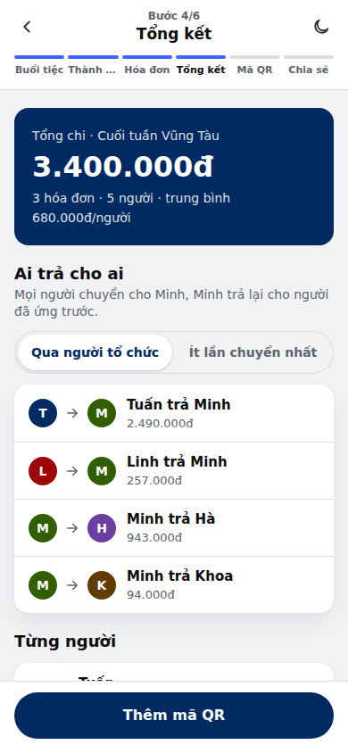

# Chia bill nhóm



Mobile-first web app (Vietnamese UI) for splitting bills at a group outing: create a party, add members and bills (with optional sponsorship and custom splits), then share one link so everyone sees what they owe and pays by scanning a QR code.

- **Stack:** Vite + React 18 + TypeScript, plain CSS (Plenti Design System colours), no UI framework.
- **Hosting:** static, deployed to GitHub Pages by `.github/workflows/deploy.yml`. Uses hash routes (`#/p/:id`) so no server routing is needed.
- **Backend:** optional. Runs without one out of the box; turn on Supabase by setting two env vars.

## Run locally

```bash
npm install
npm run dev        # http://localhost:5173
npm test           # split / settlement / VietQR unit tests
npm run build      # outputs dist/
```

## How settlement works

- Sponsorship (optional) is taken off first: "Bao trọn" means the sponsor covers the whole bill; "Tài trợ một phần" means each sponsor covers a fixed amount and the rest is split.
- Shares round to the nearest 1.000đ; the rounding difference goes to the payer.
- **Default: "Qua người tổ chức".** Everyone who owes transfers to the organiser, and the organiser pays back whoever covered a bill. So in practice only the organiser's QR matters.
- Alternative: "Ít lần chuyển nhất", which simplifies debts to the fewest transfers.

## Backend options

| Mode | When | Share link | "Đã trả" sync | Images |
| --- | --- | --- | --- | --- |
| **No backend** (default) | env vars empty | Party data compressed into the link (`#/v/…`) | Per device only | Dropped from the link (VietQR still auto-generated from bank details) |
| **Supabase** | `VITE_SUPABASE_URL` + `VITE_SUPABASE_ANON_KEY` set | Short link `#/p/<id>` | Across all devices, near real time | Stored with the party (compressed client-side) |

The code talks to storage through `src/data/store.ts` (`Store` interface), so another backend (Firebase, PocketBase, your own API) is one new file implementing `create / load / save / setPaid / remove / watch`.

### Set up Supabase (free tier is enough)

Supabase account (dashboard login): `sidal88631@bitproy.com`

1. Create a project at supabase.com.
2. SQL Editor → paste and run `supabase/schema.sql`.
   - Tables are locked with RLS and no policies.
   - All access goes through `SECURITY DEFINER` functions.
   - Editing needs the organiser key, which is stored hashed.
3. Project Settings → API: copy the **Project URL** and **anon public key** into `.env.local` (see `.env.example`).
4. For GitHub Pages: repo → Settings → Secrets and variables → Actions → **Variables**. Add `VITE_SUPABASE_URL` and `VITE_SUPABASE_ANON_KEY`. The anon key is public by design; security comes from the SQL functions.

## Deploy to GitHub Pages

1. Push to https://github.com/tanngocIT/chia-bill (branch `main`).
2. Repo → Settings → Pages → Source: **GitHub Actions**.
3. Optional: add the repo variable `VITE_PUBLIC_URL` = `https://tanngocit.github.io/chia-bill/` so share links always use the public address.
4. Every push to `main` runs tests, builds and deploys.

## Project layout

```
src/
  lib/        calc (split + settlement), qr (encoder), vietqr (EMVCo payload), format, image compression, sample data
  data/       Store interface, local (browser + link) and Supabase implementations
  components/ shared UI (icons, avatar, toast, dialog, QR)
  screens/    Home, Organizer (6-step wizard), BillEditor, Viewer (public link)
supabase/schema.sql
.github/workflows/deploy.yml  GitHub Pages workflow
design/              design spec, canvas source, DS tokens, screenshots
CLAUDE.md            context for AI coding sessions
```

## Notes

- VietQR payloads were checked by decoding the generated codes. Test-scan one with your banking app before relying on it.
- Account numbers in the sample data are placeholders.
